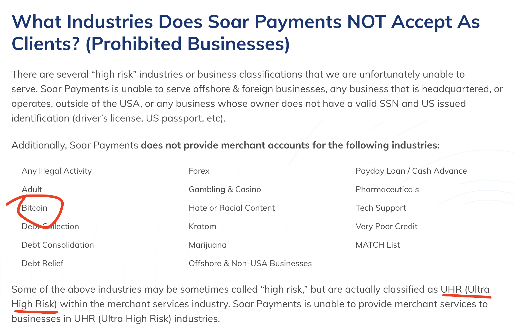

# Payment Processor - Reviewed by Ziheng

支付解决方案提供商，简评。

> https://www.topcreditcardprocessors.com/

# 名录

| 名称 | 官网 | 加密友好 | 费率 | 集成难度 |
| :--- | :--- | :----- | :--- | :----- |
| *Stripe*     | https://stripe.com/                | ✅   | 2.90% + $0.30 | 优 |
| Square     | https://squareup.com/              | 不明 | 2.60% + $0.30 | 优 |
| *Braintree*  | https://www.braintreepayments.com/ | 不明 | 2.59% + $0.49 | 优 |
| *SumUp*      | https://sumup.com/                 | 不明 | 3.25% + $0.15 | 优 |
| *Adyen*      | https://www.adyen.com/             | ✅   | Interchange + 0.60% + $0.12 | 良 |
| *Worldpay*   | https://www.fisglobal.com/en/merchant-solutions-worldpay | ✅ | 未披露 | 良 |
| National Processing | https://nationalprocessing.com/ | 不明 | Interchange + 0.29% + $0.15 | 良 |
| Helcim              | https://www.helcim.com/         | 不明 | Interchange + 0.50% + $0.25 | 良 |
| Shopify Payments | https://www.shopify.com/payments   | ❌ | 2.40% + $0.30 + $299/Month | 差 |
| Amazon Pay       | https://pay.amazon.com/            | ❌ | 2.90% + $0.30 | 差 |
| JPMorgan Chase      | https://www.chase.com/business/payments/integrated-payments | 不明 | 2.90% + $0.25 | 差 |
| SVB Financial       | https://www.svb.com/business-banking/merchant-services      | 不明 | 未披露 | 差 |
| ... | ... | ... | ... | ... |

## 点评：Stripe

估值950亿美元的全球支付巨头，代码集成方便，支付体验极佳。

Stripe 对加密业务友好，明确说支持加密企业使用，目前为**邀请制**。

上线我们官网，带着我们的资方背书，拿下 Stripe 。

> https://www.tmtpost.com/6393031.html

> https://stripe.com/use-cases/crypto

> https://support.stripe.com/questions/crypto-supportability-and-availability-by-region

## 点评：Square

另一家支付巨头，挺好用的，对商户资质有一定要求，不愿意接高风险商户的单。

我们已经被封号...

## 点评：SumUp

小而美的欧盟支付提供商，一些功能做得非常**别出心裁**，很棒。

可选为面向**欧盟客户**收款的优质解决方案，但不确定其对加密公司的态度。

## 点评：Braintree

PayPal 在 2013 年花了8亿美元收购来的一家支付提供商初创企业，目前作为 PayPal 旗下子公司运作。

支持的支付方式多样，该有的都有，还支持一些欧盟国家的本地支付方式。

对加密业务友好性方面态度不明确，需深入咨询。

较为坑爹的是费率方面存在陷阱，针对**美国客户**收款较为合适。

- 1% 费率加点：非美元货币转换
- 1% 费率加点：非美地区签发的国际卡

> https://www.usatoday.com/story/tech/2013/09/26/paypal-braintree-acquisition/2874891/

## 点评：Adyen

Adyen 是一家很有技术实力的支付方案技术提供商，SVB 的商户收款服务由其提供技术支持。

其商户条款中提到，可以支持加密企业使用，但是要通过严格的相关手续，也要费一番功夫。

- 支持的本地支付方式超级多，遍及世界各地。
- 全球各地都有办事处，包括中国大陆，有中文服务。
- 费率较高..

## 点评：Worldpay

全球支付解决方案巨头 Worldpay from FIS，支持加密业务！

> https://www.circle.com/en/

> https://www.fisglobal.com/en-au/merchant-solutions-worldpay/large-enterprise-business/b2c-ecommerce/digital-content/card-to-crypto

## 点评：Shopify Payments & Amazon Pay

电商巨头 Shopify 和 Amazon 做出来的支付方案，主要服务于自家电商平台。

Shopify 费率很棒，但这俩货有点店大欺客，不太待见加密企业，不接受买卖加密货币业务，可惜...

## 点评：JPMorgan Chase & SVB Financial

终于来到了传统银行的地盘，传统银行极其保守，风控严苛，对商户的资质要求应该也是最高的。

虽然困难，但是似乎有加密企业敲开传统银行的先例，过程较为繁琐，看来即使是传统银行，也是 case by case 的，可以谈。

> https://coinacquiring.com/

# Reference

- 支付简史：一文了解支付行业四十年发展历程
> https://www.adyen.com/zh_CN/blog/how-the-payments-industry-evolved

- 外卡 Interchange Fee 费用全解析
> https://www.adyen.com/zh_CN/blog/interchange-fees-explained

- 结算过程小科普
> https://www.uscreditcardguide.com/jiesuanguochengxiaokepudaodiyinxingshizenmehuozhijiaoyixinxide/

- 支付流程进阶指南
> https://www.uscardforum.com/t/topic/127680

<!-- EOF -->
